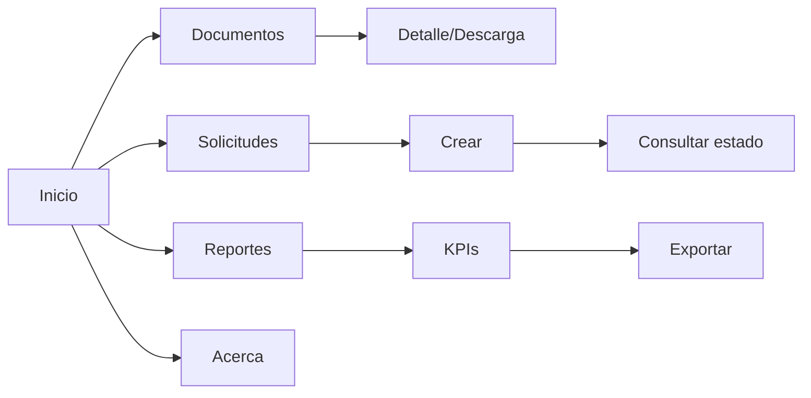

# Sistema de Gestión del Conocimiento (Records) — Web + Multimedia

**Arquitectura:** Frontend HTML5/CSS/JS estático desplegable en GitHub Pages.  
**Navegación:** Inicio, Solicitudes, Documentos, Reportes, Acerca.  
**Multimedia:** Video guía y recursos visuales.  
**Accesibilidad:** Semántica HTML, contraste, responsive.

## Mapa

## Estructura
- `/index.html` — KPIs, repositorio destacado, carta de navegación.
- `/solicitudes.html` — Registro y tabla de solicitudes.
- `/documentos.html` — Repositorio de documentos, video.
- `/reportes.html` — KPIs, acciones de exportación (demo).
- `/acerca.html` — Contexto, objetivos, manual de uso.
- `/css/styles.css` — Estilos responsive.
- `/js/script.js` — Interacciones, mock de datos y ROI.
- `/assets/img`, `/assets/video` — Recursos multimedia.

## Despliegue en GitHub Pages
1) Crea un repositorio y sube el contenido de esta carpeta.
2) En Settings → Pages, selecciona la rama y carpeta raíz.
3) Accede a la URL que genere GitHub.

> Nota: Las funciones de exportación son de demostración. Para backend (PHP/MySQL) o autenticación, integrar un API o un CMS headless.
